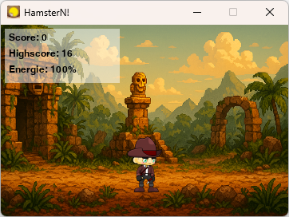
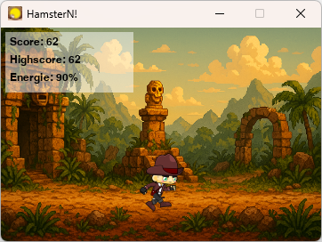
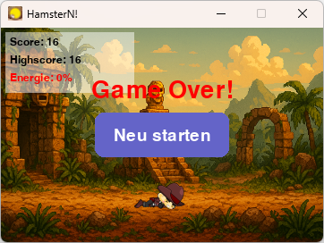

# HamsterN! - Der helfende Prokrastinat0r

  

Willkommen bei HamsterN! – einer kleinen App, das dich auf spielerische Weise bei deiner Arbeit am Computer begleitet. Dein Charakter (aktuell "Indi" der Explorer) reagiert auf deine Aktivität und sammelt mehr punkte, je mehr du tippst und klickst! (Bisher leider nur, wenn das Fenster im Fokus liegt.)


## ✨ Wieso? Die Idee dahinter

Ich wollte in mehreren Bereichen ein wenig mein Wissen erweitern, also kam die Idee eines kleinen Spiels/Apps auf. Ich wollte die Schritte vom Start bis zum "Release" auf GitHub lernen/verstehen.
Dies soll mein "erstes Projekt" sein um mir diese Schritte beizubringen. Hat auch ziemlich gut geklappt. Ich werde auf dem ganzen Aufbauen und schauen wo mich das ganze hinführen wird. Viel Spaß beim stöbern durch das Projekt.

## ✨ Features

*   **Interaktives Haustier:** Dein Charakter ("Indi") fängt an zu rennen, wenn du aktiv bist, und legt sich "schlafen", wenn seine Energie aufgebraucht ist. (Du warst zu faul!)
*   **Aktivitäts-Tracking:** Das Tierchen reagiert auf deine Tastaturanschläge und Mausbewegungen/-klicks (während das Anwendungsfenster aktiv ist).
*   **Energie-System:** Nichts tun verbraucht Energie. Ist die Energie aufgebraucht, macht dein Charakter eine Pause (oder stirbt in diesem Fall).
*   **Score & Highscore:** Sammle Punkte für deine Aktivität! Dein Highscore wird lokal gespeichert.
*   **Dynamische Animationen:** Unterschiedliche Animationen für Idle, Laufen und Schlafen.
*   **"Neu starten"-Funktion:** Wenn die Energie leer ist, kannst du einfach neu anfangen.
*   **Anpassbar:** Mit etwas Python- und Pygame-Kenntnissen kannst du eigene Charaktere und Hintergründe hinzufügen!

## 🚀 Erste Schritte / Installation

Da dieses Projekt als Lernübung und zum Spaß entwickelt wurde, wird es primär als Quellcode verteilt. Du kannst es aber auch selbst in eine ausführbare Datei umwandeln!

**Voraussetzungen (um es aus dem Quellcode auszuführen):**

*   Python 3.7+
*   Pygame: `pip install pygame`

**Ausführen:**

1.  Klone dieses Repository oder lade den Quellcode herunter.
    ```bash
    git clone https://github.com/x3kim/HamsterN.git 
    cd HamsterN-Desktop-Pet 
    ```
2.  Installiere Pygame (falls noch nicht geschehen):
    ```bash
    pip install pygame
    ```
    (oder `pip3 install pygame` je nach System)
3.  Führe das Spiel aus:
    ```bash
    python hamsterN.py
    ```
    (oder `python3 hamsterN.py`)

**Selbst eine `.exe` erstellen (optional):**

Wenn du eine eigenständige `.exe`-Datei (für Windows) erstellen möchtest, kannst du PyInstaller verwenden:

1.  Installiere PyInstaller: `pip install pyinstaller`
2.  Navigiere in das Projektverzeichnis und führe aus:
    ```bash
    pyinstaller --name "HamsterN" --onefile --windowed --icon="assets/hamsterN_ICON.ico" --add-data "assets:assets" hamsterN.py
    ```
3.  Die fertige `HamsterN.exe` findest du im `dist`-Ordner.

## 🛠️ Verwendete Technologien

*   **Python:** Die Programmiersprache, in der das Spiel entwickelt wurde.
*   **Pygame:** Eine plattformübergreifende Python-Bibliothek zum Erstellen von Spielen und Multimedia-Anwendungen.

## 🖼️ Assets

*   Der Charakter ("Indi") wurde von https://www.gameart2d.com/temple-run---free-sprites.html entnommen.
*   Du findest alle Assets im `assets/`-Ordner.
    *   Hintergründe: `assets/background/`
    *   Charakter-Sprites: `assets/char/indi/`
    *   Icon: `assets/hamsterN_ICON.ico`

## 💡 Mögliche zukünftige Erweiterungen

*   Mehr Charaktere zur Auswahl.
*   Verschiedene Hintergrundbilder, vielleicht sogar passend zur Tageszeit.
*   Soundeffekte für Aktionen oder Zustandsänderungen.
*   Konfigurierbare Aktivitäts-Schwellenwerte.
*   Ein "richtiges" Schlafsystem bei längerer Inaktivität (unabhängig vom Energielevel).

## 🤝 Beitrag leisten (Contributing)

Dieses Projekt ist als kleines, spaßiges Lernprojekt gestartet. Wenn du Ideen hast oder Fehler findest, erstelle gerne ein "Issue"! Pull Requests sind ebenfalls willkommen, wenn du das Projekt erweitern möchtest.

## 📝 Lizenz

Dieses Projekt steht unter der [MIT-Lizenz](LICENSE). 

---

Viel Spaß! 🐹✨